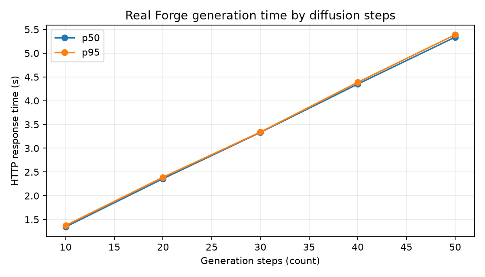

# Queue response benchmark

## Scope

This report measures the user-visible response change introduced by the backend
job queue. It compares the synchronous AI-engine request path with the queued
backend path using the same mock Forge configured with a fixed 10-second delay.
The run used three independent batches of five simultaneous jobs per path.

The SQLite database was created through the Alembic migration chain. The queued
path used normal registration, login, CSRF protection, `POST /api/generate`, and
polling through `GET /api/jobs/<id>` until every job reached `done`.

## Results

| Measurement | Samples | p50 | p95 |
|---|---:|---:|---:|
| Synchronous `POST /forge/txt2img` response | 15 | 10.036 s | 10.090 s |
| Queued `POST /api/generate` HTTP 202 | 15 | 0.0169 s | 0.0219 s |
| `GET /api/jobs/<id>` status poll | 1,667 | 0.00543 s | 0.00985 s |
| Queued time until job completion | 15 | 30.237 s | 50.323 s |

The median queued submission response was about **595× faster** than waiting for
the synchronous image response. This result shows that the queue removes the
long wait from the HTTP submission request. It does not make image generation
itself faster: one worker still processes the five jobs sequentially, so the
fifth completion in a batch occurs at about 50 seconds.

Raw trials are in `queue_comparison_raw.csv`; exact summary values are in
`queue_comparison_summary.csv`; environment and workload details are in
`queue_comparison_metadata.json`.

## Filter timing

On the same machine, a 15×15 direct 2D box convolution took 13.283 ms median and
the equivalent separable implementation took 0.816 ms median, a **16.28× measured
speedup**. The maximum output difference was 0.0000763, confirming numerical
equivalence within floating-point precision.

## Real Forge generation time by steps

The real-GPU run used the `counterfeitV30_v30` checkpoint, `DPM++ 2M` sampler,
Karras scheduler, fixed seed `12345`, and 512×512 output. The AI engine and Forge
ran on the same Windows 11 machine through localhost, avoiding network-tunnel
latency. One warm-up generation was excluded. The 25 recorded requests used a
balanced order across five repeats and step counts from 10 to 50. A two-second
cooldown between requests was not included in the measured latency.

| Steps | Samples | p50 | p95 | Observed range |
|---:|---:|---:|---:|---:|
| 10 | 5 | 1.344 s | 1.373 s | 1.329–1.376 s |
| 20 | 5 | 2.359 s | 2.389 s | 2.348–2.395 s |
| 30 | 5 | 3.333 s | 3.339 s | 3.319–3.340 s |
| 40 | 5 | 4.350 s | 4.388 s | 4.327–4.395 s |
| 50 | 5 | 5.338 s | 5.388 s | 5.322–5.390 s |

Generation time increased by about **0.100 seconds per step** on this GPU. A
linear fit over all 25 requests gives `time = 0.100 × steps + 0.351 seconds`, with
R² = **0.9997**. Every repeat remained within 0.07 seconds of the others, and the
recorded trials required no retries. These timings describe this particular
model, machine, and image size; they are evidence of the relationship between
steps and processing time rather than a universal speed claim.

An earlier run through a public Gradio tunnel was rejected because request order
explained the latency better than step count. This local measurement replaces
that data. Raw values, summary values, and run settings are stored beside this
report in the corresponding `generation_by_steps_*` files.
